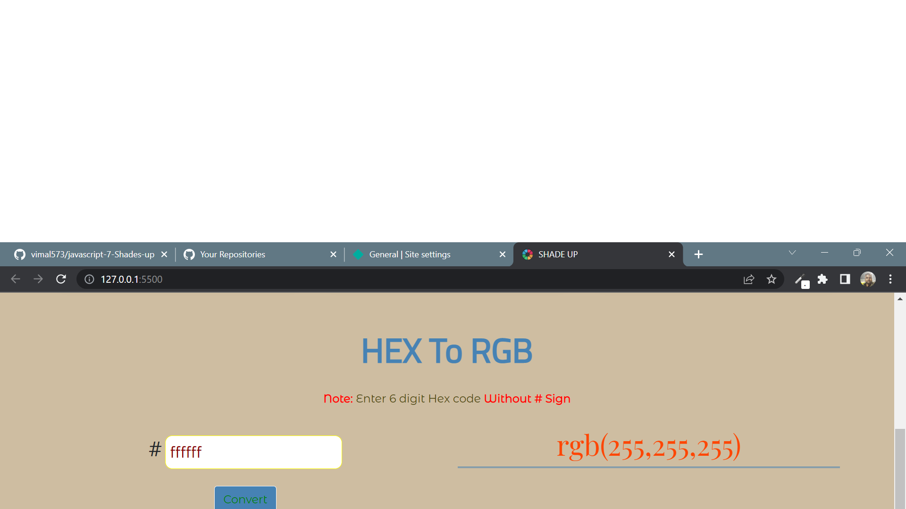

# Javascript Assignment Shades Up

## Shades up [Live Link](https://shades-up.netlify.app/)

- Skills Gained in this project

  - generate random color

  - convert hexadecimal number to decimal number and decimal to hexadecimal number

  - manupulate css through javascript

---

## Time taken to finish this project

- 2 hr to complete it

#### Screenshot

